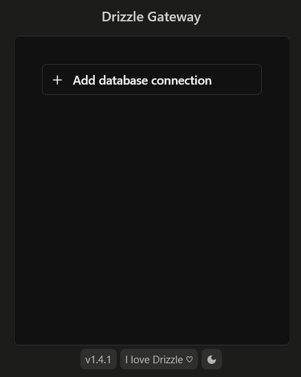
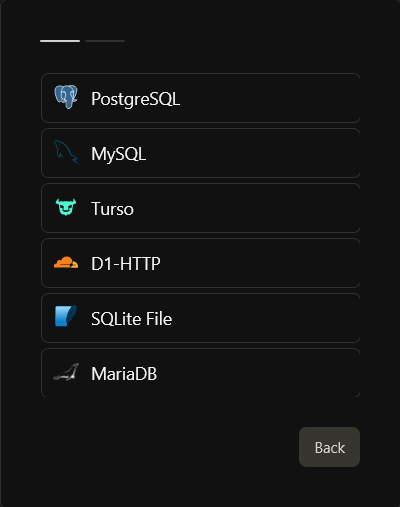
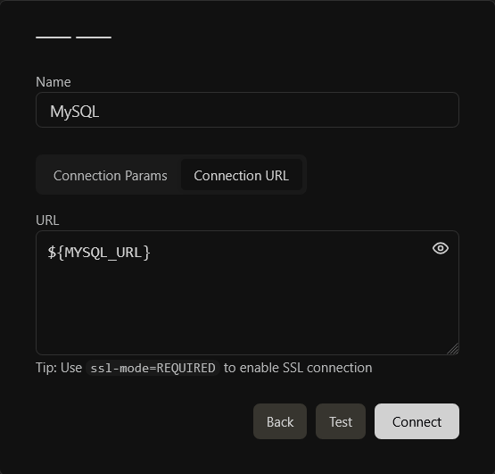
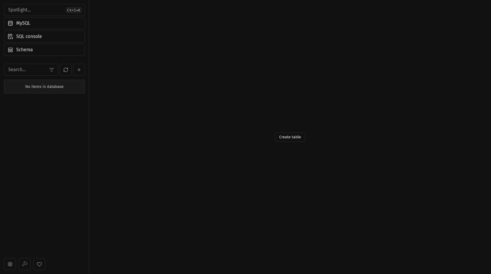
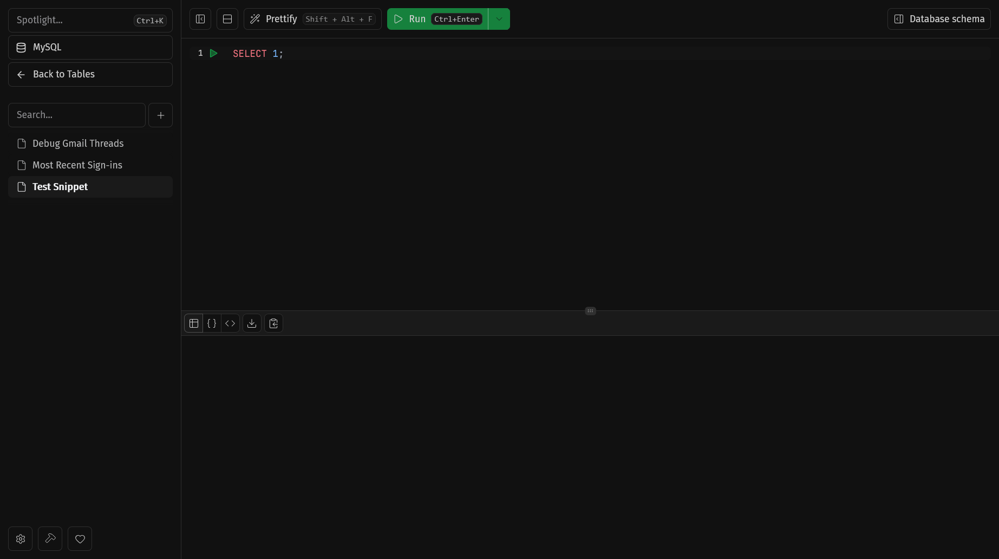
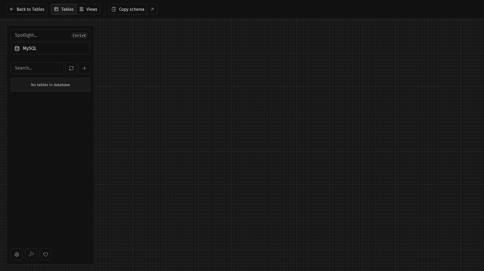

# MySQL + Drizzle Gateway

This repository features a simple setup for hosting MySQL in front of a Drizzle Gateway proxy for local development.

## Prerequisites

The following tools are required to run this setup:

- [Docker](https://docs.docker.com/get-started/get-docker/) (with Docker Compose)
- [Just](https://just.systems/man/en/packages.html) (optional, but recommended)

## Working with Docker Compose

When using the `just` task runner, you may use the following commands to start and stop the services.

```shell
# Starts MySQL in the background, proxied behind the Drizzle Gateway UI.
# Alias: `docker compose up --wait`
just start
```

```shell
# Stops all of the containers and cleans up resources.
# Recommended when you're done working to avoid background usage.
# Alias: `docker compose down --remove-orphans`
just stop
```

## Opening Drizzle Gateway

The setup exposes the Drizzle Gateway UI on `http://localhost:4983`. Visit that in your web browser to access the app. (This is effectively what replaces the buggy MySQL Workbench.)

1. Select "Add database connection".
1. Select "MySQL" among the supported databases.
1. Select the "Connection URL" mode and use preconfigured `${MYSQL_URL}` as the provided value.

<details>
<summary>

### Screenshots

</summary>







</details>

## Working with Drizzle Gateway

There are only three main pages that you have to worry about in Drizzle Gateway:

- The Tables View
- The SQL Console
- The Schema View

> [!NOTE]
> The following screenshots feature empty UIs because the setup points to an empty database by default. Use `CREATE TABLE` in the SQL console to populate the database with tables and data.

### The Tables View

This is your typical table view of all known tables in the database and their rows. Use this to quickly filter, sort, paginate, and spot-check a subset of your dataset.



### The SQL Console

This is your ad-hoc SQL console for running arbitrary queries against the database. Use this to setup new tables, run complex queries, and perform data transformations.

For your most frequently used queries, save them as snippets for future use.



### The Schema View

This is your database schema visualizer. Use this to get a high-level overview of the database structure and relationships.


